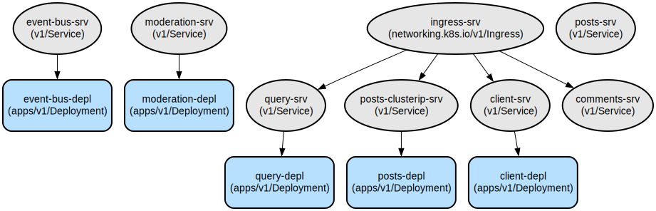

# Blog Microservices Platform: A Scalable Blog System with Comment Moderation

This project implements a microservices-based blog platform that enables users to create posts, add comments, and automatically moderate content. The system leverages Kubernetes for orchestration and implements event-driven communication between services for reliable data consistency.

The platform consists of six microservices that work together to provide a complete blogging experience. Each service is containerized and independently deployable, making the system highly scalable and maintainable. The platform features automatic comment moderation, real-time updates through an event bus, and a React-based frontend for seamless user interaction. The infrastructure is defined as code using Kubernetes manifests and managed through Skaffold for streamlined development and deployment.

## Repository Structure
```
blog-ms/
├── client/                 # React frontend application
├── comments/              # Comment management service
├── event-bus/            # Event distribution service for inter-service communication
├── infra/                # Infrastructure configuration
│   ├── docs/            # Infrastructure documentation and diagrams
│   └── k8s/             # Kubernetes manifests for service deployment
├── moderation/           # Comment moderation service
├── posts/               # Post management service
├── query/               # Data query service for consolidated views
└── skaffold.yml        # Skaffold configuration for development workflow
```

## Usage Instructions
### Prerequisites
- Docker Desktop with Kubernetes enabled
- Node.js v14 or later
- Skaffold CLI
- kubectl CLI
- A Kubernetes-compatible Ingress Controller (nginx-ingress recommended)

### Installation

1. Clone the repository:
```bash
git clone <repository-url>
cd blog-ms
```

2. Update your hosts file to include the domain:
```bash
# On Unix/MacOS: /etc/hosts
# On Windows: C:\Windows\System32\Drivers\etc\hosts
127.0.0.1 posts.com
```

3. Install dependencies for all services:
```bash
cd client && npm install
cd ../comments && npm install
cd ../event-bus && npm install
cd ../moderation && npm install
cd ../posts && npm install
cd ../query && npm install
```

4. Start the application using Skaffold:
```bash
skaffold dev
```

### Quick Start
1. Access the application at http://posts.com
2. Create a new post using the "Create Post" form
3. Add comments to posts using the comment form below each post
4. Comments containing the word "orange" will be automatically approved

### More Detailed Examples
1. Creating a post:
```javascript
// POST http://posts.com/posts/create
{
  "title": "My First Blog Post"
}
```

2. Adding a comment:
```javascript
// POST http://posts.com/posts/:id/comments
{
  "content": "This is a great post!"
}
```

### Troubleshooting
1. Pods not starting
- Check pod status: `kubectl get pods`
- View pod logs: `kubectl logs <pod-name>`
- Ensure Kubernetes is running: `kubectl cluster-info`

2. Network connectivity issues
- Verify Ingress configuration: `kubectl get ingress`
- Check service status: `kubectl get svc`
- Ensure hosts file is configured correctly

## Data Flow
The system uses an event-driven architecture where services communicate through the event bus to maintain data consistency.

```ascii
[Client] --> [Ingress] --> [Posts/Comments Services]
                              |
                              v
                        [Event Bus]
                              |
                              v
[Query Service] <-- [Moderation Service]
```

Component interactions:
1. Client sends requests through the Ingress controller
2. Posts and Comments services handle write operations
3. Event bus distributes events to all relevant services
4. Moderation service processes new comments
5. Query service maintains a consolidated view of all data
6. Services communicate using JSON over HTTP
7. Each service maintains its own data store

## Infrastructure


### Kubernetes Resources
- Deployments:
  - client-depl: React frontend application
  - posts-depl: Post management service
  - comments-depl: Comment management service
  - event-bus-depl: Event distribution service
  - moderation-depl: Comment moderation service
  - query-depl: Data query service

- Services:
  - client-srv: Exposes frontend on port 3000
  - posts-clusterip-srv: Internal post service on port 4000
  - comments-srv: Comment service on port 4001
  - query-srv: Query service on port 4002
  - moderation-srv: Moderation service on port 4003
  - event-bus-srv: Event bus service on port 4005

- Ingress:
  - ingress-srv: Routes external traffic to appropriate services

## Deployment
1. Prerequisites:
   - Kubernetes cluster
   - kubectl configured
   - Docker registry access

2. Deployment steps:
```bash
# Apply Kubernetes configurations
kubectl apply -f infra/k8s/

# Verify deployments
kubectl get deployments
kubectl get pods
kubectl get services
```

3. Environment configurations:
- Update image references in deployment files if using a different registry
- Configure ingress host names as needed
- Adjust resource limits in deployment files if necessary