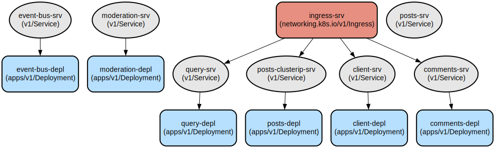

# Kubernetes-Based Blog Microservices Platform

This project implements a scalable blog platform using a microservices architecture deployed on Kubernetes. It provides a modular and maintainable solution for creating, managing, and moderating blog posts with comments through distinct, independently deployable services.

The platform consists of several microservices including posts, comments, moderation, query, and event-bus services, all orchestrated using Kubernetes. The architecture follows event-driven patterns to maintain data consistency across services while ensuring loose coupling. Each service is containerized and can be scaled independently based on demand.

## Repository Structure
```
blog-ms/
└── infra/
    └── k8s/                          # Kubernetes deployment configurations
        ├── client-depl.yml          # Client application deployment (port 3000)
        ├── comments-depl.yml        # Comments service deployment (port 4001)
        ├── event-bus-depl.yml       # Event bus service deployment (port 4005)
        ├── ingress-srv.yml          # Nginx ingress controller configuration
        ├── moderation-depl.yml      # Content moderation service (port 4003)
        ├── posts-depl.yml           # Posts service deployment (port 4000)
        ├── posts-srv.yml            # NodePort service for posts
        └── query-depl.yml           # Query service deployment (port 4002)
```

## Usage Instructions

### Prerequisites
- Kubernetes cluster (local or cloud-based)
- kubectl CLI tool installed and configured
- Docker Desktop (for local development)
- Nginx Ingress Controller installed in the cluster
- Domain name configured (posts.com) in local hosts file or DNS

### Installation

1. Clone the repository:
```bash
git clone <repository-url>
cd blog-ms
```

2. Apply the Kubernetes configurations:
```bash
kubectl apply -f infra/k8s/
```

3. Verify the deployments:
```bash
kubectl get deployments
kubectl get services
kubectl get pods
```

### Quick Start

1. Configure your hosts file to point posts.com to your cluster IP:
```bash
# Add to /etc/hosts (Linux/MacOS) or C:\Windows\System32\drivers\etc\hosts (Windows)
127.0.0.1 posts.com
```

2. Access the application:
- Browse to `http://posts.com` to access the client application
- Create posts at `http://posts.com/posts/create`
- View posts at `http://posts.com/posts`

### Troubleshooting

Common Issues:

1. Pods not starting:
```bash
kubectl describe pod <pod-name>
kubectl logs <pod-name>
```

2. Service connectivity issues:
```bash
kubectl get svc
kubectl describe svc <service-name>
```

3. Ingress problems:
```bash
kubectl get ingress
kubectl describe ingress ingress-srv
```

## Data Flow

The platform follows an event-driven architecture where services communicate through the event-bus service. When a post is created or commented on, events propagate through the system to maintain consistency.

```ascii
Client Request → Ingress → Service → Event Bus → Relevant Services
                                   ↓
                             [Moderation]
                                   ↓
                          [Data Synchronization]
```

Component Interactions:
1. Client sends requests through the Ingress controller
2. Posts service handles post creation (port 4000)
3. Comments service manages post comments (port 4001)
4. Query service provides data aggregation (port 4002)
5. Moderation service filters content (port 4003)
6. Event bus coordinates communication between services (port 4005)
7. Services maintain eventual consistency through event propagation

## Infrastructure



### Deployments
- **Client**: Single replica of `qassimov/client:latest`
- **Posts**: Single replica of `qassimov/posts:latest`
- **Comments**: Single replica of `qassimov/comments:latest`
- **Query**: Single replica of `qassimov/query:latest`
- **Event Bus**: Single replica of `qassimov/event-bus:latest`
- **Moderation**: Single replica of `qassimov/moderation:latest`

### Services
- **Client Service**: ClusterIP service on port 3000
- **Posts Service**: NodePort service on port 4000
- **Comments Service**: ClusterIP service on port 4001
- **Query Service**: ClusterIP service on port 4002
- **Moderation Service**: ClusterIP service on port 4003
- **Event Bus Service**: ClusterIP service on port 4005

### Ingress
- Nginx Ingress Controller
- Path-based routing to services
- Regular expression support enabled
- Host: posts.com